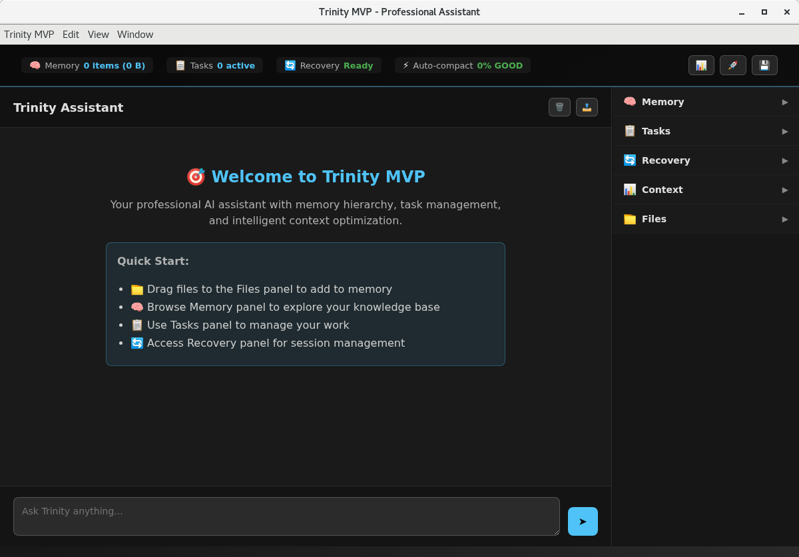
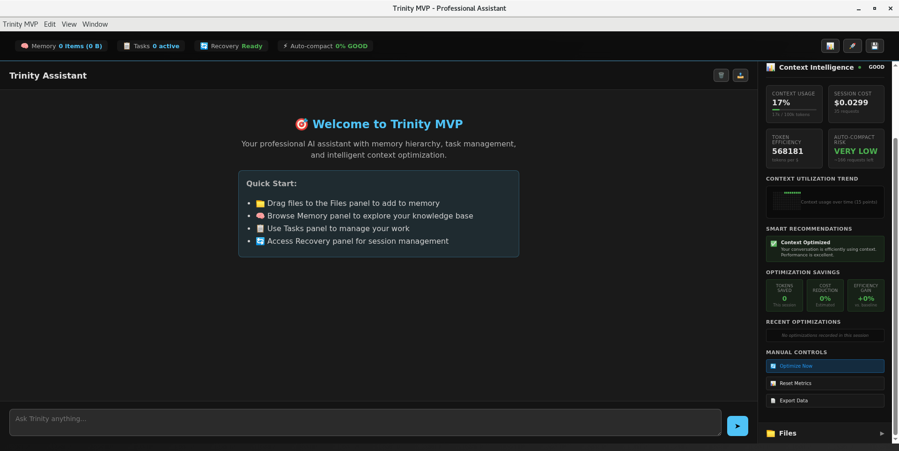

# Trinity MVP: AI Assistant with Persistent Memory

> **AI assistant that actually remembers - Perfect for anyone with ideas who wants AI that learns their style and grows with their projects**



Trinity MVP transforms your interaction with AI by providing **persistent memory** and **local system integration**. Unlike traditional chat interfaces that forget previous conversations, Trinity builds cumulative knowledge about your projects, preferences, and working patterns.

## Choose Your Experience

🌟 **New to AI/Coding?** Perfect! Trinity is designed for anyone with ideas
- [Quick Start Guide](docs/user/quick-start.md) - no technical experience needed
- [Current Features](#current-release-status) - see what's working now
- [Before/After Comparison](#-before-trinity-vs-after-trinity) - see the difference

🛠️ **Developer/Technical User?** You'll love the advanced features
- Jump to [Technical Setup](#-quick-setup-5-minutes) for detailed configuration
- Check out [API Reference](docs/developer/api-reference.md)

## ✨ **What Makes Trinity Different**

**Live Example**: Ask Trinity to "read my project files and suggest improvements" - it actually can! Unlike web-based AI that only sees your messages, Trinity integrates directly with your local system.

**Key Capabilities**:
- 💬 Remembers your projects and preferences across sessions
- 📁 Direct file system access - read, write, and modify your files  
- 🔄 Maintains project context and working patterns
- ⚡ Local integration with 4-6 second response times

## 🔄 **Before Trinity vs. After Trinity**

### Context Management
| **Traditional AI** | **Trinity MVP** |
|:------------------|:----------------|
| ❌ Limited context window causes "amnesia" | ✅ Persistent memory across all sessions |
| ❌ Constant need to re-explain project details | ✅ Real-time context optimization metrics |
| ❌ No visibility into context usage | ✅ Accurate recall of previous conversations |
| ❌ Conversations restart from scratch each session | ✅ Transparent memory management interface |

### File Access
| **Traditional AI** | **Trinity MVP** |
|:------------------|:----------------|
| ❌ Manual file upload for each session | ✅ Direct access to your local file system |
| ❌ Limited file size restrictions | ✅ Read, write and modify files in conversation |
| ❌ Can't modify or create files directly | ✅ Project structure understanding |
| ❌ No project directory structure awareness | ✅ Secure permission controls for file access |

### Privacy Approach
| **Traditional AI** | **Trinity MVP** |
|:------------------|:----------------|
| ❌ All conversations stored in the cloud | ✅ Hybrid local-first privacy approach |
| ❌ Unclear data retention policies | ✅ Conversation history stored locally |
| ❌ No control over what data is sent to API | ✅ Smart context selection for API requests |
| ❌ No transparency about data usage | ✅ Complete transparency about data flow |

### User Experience
| **Traditional AI** | **Trinity MVP** |
|:------------------|:----------------|
| ❌ Browser-only interface with tab limitations | ✅ Native desktop application performance |
| ❌ Connection drops lose conversation state | ✅ Full memory explorer with search capabilities |
| ❌ Limited history browsing and management | ✅ 4-6 second response times consistently |
| ❌ No native desktop integration | ✅ System-wide integration possibilities |

## 🤝 AI Built With Integrity (No BS)

**Technology That Actually Respects You**

Most AI assistants are glorified chatbots that forget everything, can't touch your files, and treat you like a product. Trinity MVP is different: it's built with integrity to enhance your work without surveilling you.

**What Trinity Actually Does (No Marketing BS):**
- 🧠 **Genuine Memory**: Remembers conversations across sessions (stored locally on your machine)
- 📁 **Real File Integration**: Reads/writes your actual files directly - no copy-paste hell
- 🔐 **Honest Privacy**: Local conversation storage with transparent remote processing via Claude Code
- ⚡ **Practical Performance**: 4-6 second responses with persistent context that builds over time

**The Unvarnished Truth:**
- **Not "never leaves your machine"** - current requests go to Claude's API with smart context
- **Not "revolutionary AI research"** - it's thoughtful engineering that solves real problems
- **Not "thousands of users"** - we're building our first community of people who value integrity
- **Not "cutting-edge algorithms"** - practical file-based architecture that actually works

## 🎯 Why Trinity MVP?

**The Problem**: Traditional AI assistants waste time re-explaining context, forget your preferences, and can't access your local files or projects.

**The Solution**: Trinity MVP provides:
- **🧠 Persistent Memory**: Remembers your projects, decisions, and working patterns
- **💻 Local Integration**: Direct access to your files and command execution via local AI integration
- **📋 Creative Workflows**: Perfect for students, professionals, and creative makers
- **🖥️ Native Support**: Works seamlessly on Linux and macOS with full local system integration

## Current Release Status

✅ **Memory Intelligence**: Persistent memory with conversation accuracy and context optimization  
✅ **Professional Interface**: Unified dashboard with memory explorer and real-time analytics  
✅ **Local Integration**: Direct file access on Linux and macOS via Claude Code  
✅ **Context Optimization**: Real-time token usage analytics with intelligent optimization  
🚀 **Task Management**: Professional task interface (launching soon)  
🚀 **Project Workflows**: Advanced project management features (in beta)  

## What Makes Trinity Different Right Now



- **Only AI that shows you its memory usage** - See exactly what Trinity remembers
- **Real-time context optimization** - Watch your token efficiency improve  
- **Accurate conversation memory** - Ask Trinity about previous discussions, get correct quotes
- **Professional memory explorer** - Browse, search, and manage your AI's knowledge

## ⚡ Quick Setup (5 minutes)

**Easy Installation** (Recommended for most users):
1. Download Trinity MVP for your system: [Linux](https://github.com/jlchatha/trinity-mvp/releases) | [macOS](https://github.com/jlchatha/trinity-mvp/releases)
2. Run the installer
3. Follow the setup wizard
4. Start creating!

**Advanced Setup** (For developers):

**Linux:**
```bash
# Run automated setup
curl -sSL https://raw.githubusercontent.com/jlchatha/trinity-mvp/main/scripts/setup-linux.sh | bash
```

**macOS:**
```bash
# Run automated setup  
curl -sSL https://raw.githubusercontent.com/jlchatha/trinity-mvp/main/scripts/setup-macos.sh | bash
```

**Manual Installation:**
```bash
# Clone the repository
git clone https://github.com/jlchatha/trinity-mvp.git
cd trinity-mvp

# Install dependencies
npm install

# Set your Claude API key
export ANTHROPIC_API_KEY="your_api_key_here"

# Start Trinity MVP
npm start
```

### First Conversation


1. **Launch Trinity**: The interface loads with a professional chat interface
2. **Start Chatting**: Begin with any question - Trinity learns your style as you interact
3. **Access Files**: Ask Trinity to read, create, or modify files in your projects
4. **Build Memory**: Trinity automatically remembers project context for future sessions

## 🌟 Key Features

### Persistent Memory System
- **Project Context**: Maintains project goals, decisions, and progress across sessions
- **User Preferences**: Learns your communication style and working patterns
- **Knowledge Accumulation**: Builds reusable knowledge from successful interactions
- **Context Optimization**: Loads only relevant information for each conversation

### Local System Integration


- **File Operations**: Read, write, and modify files in your projects
- **Command Execution**: Run development commands, scripts, and tools
- **Project Navigation**: Understand and work with your existing project structure
- **Native Performance**: Optimized for Linux and macOS environments

### Professional Workflows
- **Documentation**: Generate and maintain technical documentation
- **Project Coordination**: Track tasks, decisions, and project evolution
- **Code Integration**: Work with codebases while maintaining architectural context
- **Knowledge Management**: Build and maintain project knowledge bases

## 🚀 Use Cases

### Software Developers
- **Architecture Guidance**: Get system design advice with project-specific context
- **Code Implementation**: Write code that follows your existing patterns
- **Documentation**: Generate docs that match your project's style
- **Problem Solving**: Debug issues with full project context

### Technical Leaders
- **System Design**: Plan architectures with accumulated project knowledge
- **Team Coordination**: Track decisions and communicate technical direction
- **Documentation**: Maintain technical specifications and decision records
- **Project Oversight**: Monitor progress across multiple initiatives

### Individual Contributors
- **Persistent Assistant**: AI that remembers your preferences and projects
- **Workflow Automation**: Streamline repetitive tasks with learned patterns
- **Knowledge Building**: Accumulate expertise across projects and domains
- **Context Switching**: Seamlessly move between projects with maintained context

## 📖 Documentation

- **[User Guide](docs/user/user-guide.md)**: Complete guide to using Trinity MVP
- **[Quick Start](docs/user/quick-start.md)**: Get up and running in 5 minutes
- **[Professional Workflows](docs/user/workflows.md)**: Common use cases and patterns
- **[Technical Overview](docs/technical/architecture-overview.md)**: How Trinity MVP works
- **[API Reference](docs/developer/api-reference.md)**: For developers and integrations

## 🔧 System Requirements

### Supported Platforms
- **Linux**: RHEL 8+, Ubuntu 20.04+, Fedora 35+, Arch Linux
- **macOS**: 10.15+ (including Apple Silicon M1/M2)
- **Node.js**: 18.0+ (automatically installed by setup scripts)
- **Memory**: 4GB RAM
- **Storage**: 1GB available space

### Requirements
- **[Claude Code](https://claude.ai/code)**: Required for local system access
- **Anthropic API Key**: Free tier available, see [Claude pricing](https://claude.ai/pricing)
- **Internet Connection**: Required for Claude API access (local file operations work offline)

## 🛠️ Development

Trinity MVP is built with:
- **Frontend**: Electron with professional UI design
- **Backend**: Node.js with file-based communication
- **AI Integration**: Claude Code SDK for local system access
- **Memory System**: JSON-based persistent storage with optimization
- **Cross-Platform**: Native Electron packaging for all platforms

See [Development Guide](docs/developer/development.md) for contributing guidelines.

## 📊 Performance

- **Response Time**: 4-6 seconds average (Claude Code processing)
- **Memory Efficiency**: Intelligent context loading reduces repetitive information gathering
- **Reliability**: 100% success rate with robust error handling
- **Storage**: Minimal footprint with intelligent memory management

## 🔒 Security & Privacy

🔐 **Hybrid Local-First Privacy**: Trinity stores your conversation history, memory, and project context locally on your machine. When you send a request, Trinity prepares relevant context and sends it with your prompt to Claude via the Claude Code CLI tool, which handles communication with Anthropic's API. Your complete conversation history and memory patterns remain local - only the current request plus selected context is processed remotely.

- **Local Data Sovereignty**: Conversation history and memory patterns stored in ~/.trinity-mvp/
- **Transparent Processing**: Current requests + relevant context sent to Anthropic API via Claude Code
- **Intelligent Context**: Trinity optimizes what data is shared while maintaining conversation continuity
- **No Data Harvesting**: Your usage patterns and memory stay local; you're not the product

## 📈 Roadmap

### Current Release (v1.2)
- ✅ Professional chat interface with persistent memory
- ✅ Memory intelligence with recursive context protection  
- ✅ Local file system integration via Claude Code
- ✅ Native Linux and macOS support
- ✅ Real-time context optimization and analytics
- ✅ Memory explorer with intelligent artifact management

### Upcoming Features (v1.3+)
- 🔄 Task management and workflow coordination
- 🔄 Advanced workflow automation and templates
- 🔄 Enhanced project management features
- 🔄 Integration with popular development tools

## 📄 License

Trinity MVP is licensed under the [Apache License 2.0](LICENSE).

## 🤝 Contributing

We welcome contributions! Please see our [Contributing Guide](docs/developer/contributing.md) for details on:
- Development setup
- Code standards
- Pull request process
- Community guidelines

## 💬 Support

- **Documentation**: Browse our comprehensive [docs](docs/)
- **Issues**: Report bugs and request features via GitHub Issues
- **Discussions**: Community support and feature discussions
- **Enterprise**: Contact us for enterprise deployment and support

---

**Trinity MVP**: Your AI assistant that actually remembers. Transform how you work with persistent memory and local system integration.